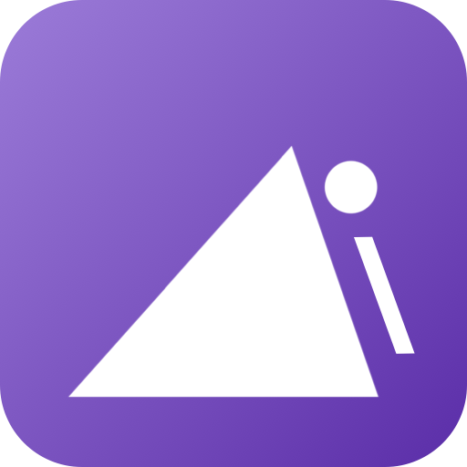
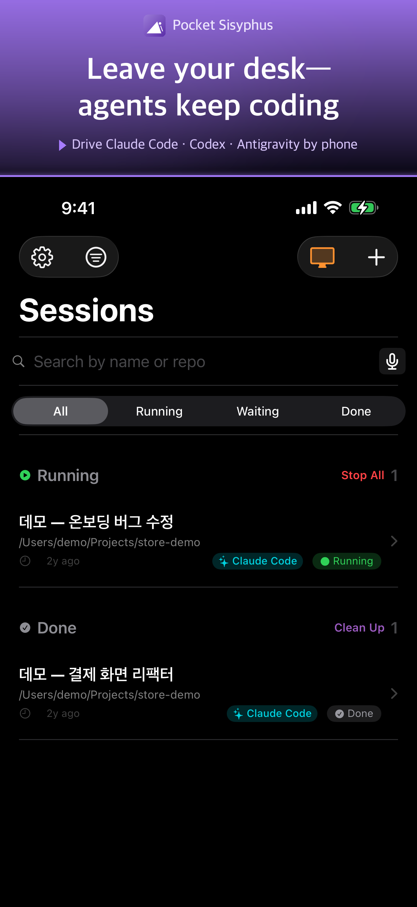
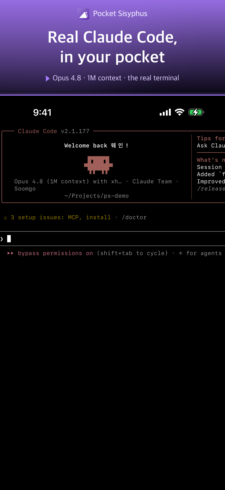
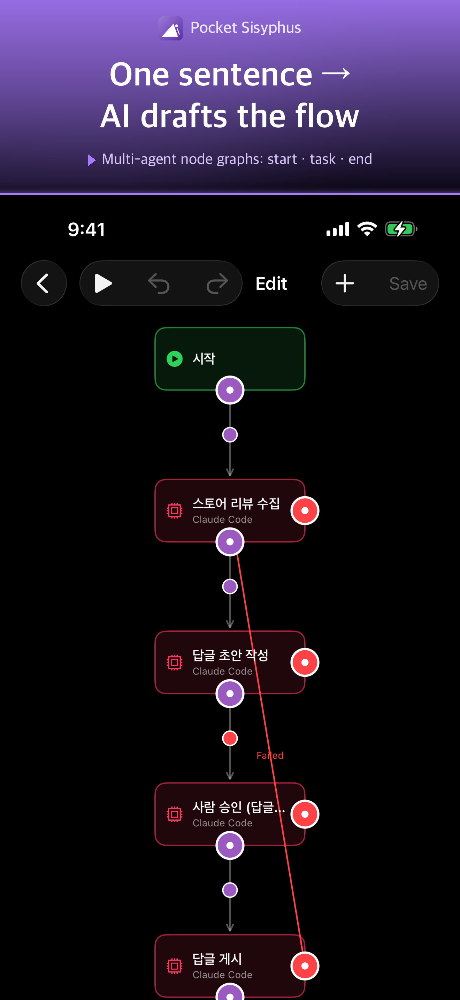
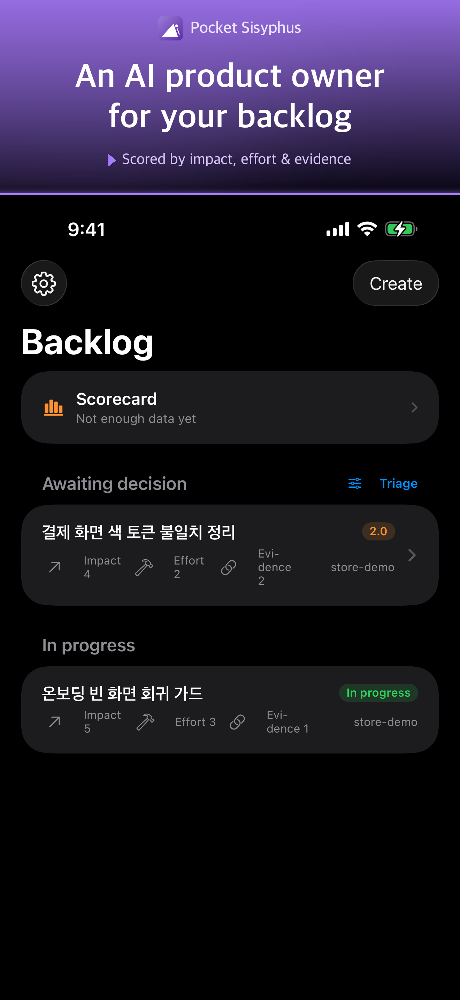
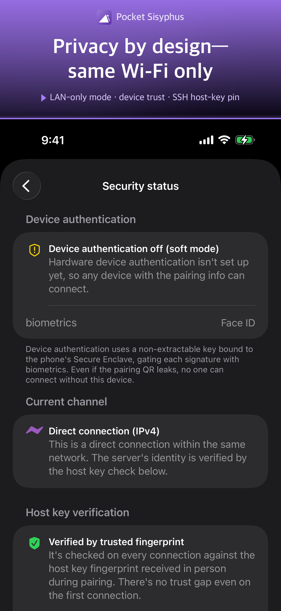

[English](README.md) · **한국어**

<div align="center">



# Pocket Sisyphus

<p><strong>맥에서 돌아가는 코드 에이전트 CLI를 폰의 LTE/5G에서 안전하게 제어.</strong></p>

<p>듀얼 채널 (SSH-first + Tor fallback) + iOS 네이티브 앱. (두 앱 기준) 외부 서버 0 · 유료 인프라 0 · 100% OSS 스택. 앱은 무료 + 선택형 Pro.</p>

<p>
  <a href="https://apps.apple.com/app/pocket-sisyphus/id6772206998"><strong>📱 App Store (iPhone)</strong></a> &nbsp;·&nbsp;
  <a href="#설치-mac"><strong>💻 Mac 설치</strong></a> &nbsp;·&nbsp;
  <a href="https://wayne-kim.github.io/pocket-sisyphus"><strong>🌐 웹사이트</strong></a>
</p>

<p>
  
  
  
  
  
</p>

</div>

## 지원하는 코드 에이전트

세션마다 사용할 코드 에이전트 CLI를 픽커에서 선택할 수 있다 (daemon이 사용자 시스템에 설치된 CLI 바이너리를 `node-pty`로 spawn).

- **Claude Code** (Anthropic)
- **Google Antigravity (`agy`)** (Google)
- **OpenAI Codex** (OpenAI)
- **GitHub Copilot CLI** (GitHub)
- **OpenCode** (오픈소스 · OpenAI 호환 엔드포인트)

<!-- 이 목록의 SSOT 는 에이전트 픽커다: iOS `ios/PocketSisyphus/Models/AgentKind.swift` +
     daemon `mac/daemon/src/agent/index.ts` 의 adapter 등록 순서. 픽커에 코드 에이전트를
     추가/제거하면 «에이전트 목록을 노출하는 모든 표면» 을 함께 갱신해 정합을 유지한다
     (한 곳만 고치면 신규 사용자가 «내 에이전트 지원되나» 를 표면마다 다르게 읽는 드리프트가 난다):
       1. 이 README 위 「지원하는 코드 에이전트」 목록, 그리고 영어 원본 미러 `README.md`
          (문서 쌍으로 함께 동기화).
       2. web 랜딩 `web/content/site.en.ts` — `agents.items` 구조화 목록 + 본문 카피
          (`meta.description`, `hero.tagline`, pricing 의 «Agent usage (…)»). 단일 영어
          랜딩이라 다국어화는 안 한다(설계상 그대로).
       3. iOS 인앱 가이드 `ios/PocketSisyphus/Models/GuideContent.swift` (앱 소개·세션 CLI·
          이어받기 후보 3곳) + 그 문구는 노출 문자열이라 `ios/PocketSisyphus/Localizable.xcstrings`
          10개 로케일 번역까지(자동 추출 ≠ 번역 완료 — 제품명은 비번역, 모든 로케일 동일 표기).
       4. Mac 인앱 가이드 `mac/PocketSisyphusMac/GuideContent.swift` (동일 3곳) +
          `mac/PocketSisyphusMac/Localizable.xcstrings` 10개 로케일 번역.
     표기·열거 순서는 픽커를 따른다 — 제품명은 displayName(예: 「GitHub Copilot CLI」),
     순서는 daemon 등록 순서(Claude Code → Antigravity → Codex → Copilot → OpenCode).
     특수/비-노출(코드 에이전트 아님)인 shell=Terminal·local_llm=Qwen Code 는 «고급 도구» 로
     분류해 «지원하는 코드 에이전트» 목록엔 넣지 않는다(가이드의 「프로 기능」 묶음에만 노출).
     이 5개 표면의 정합은 `scripts/agent-surfaces-lint.sh` 가 픽커 SSOT 와 대조해 점검한다. -->

모델 추론 자체는 각 에이전트 CLI가 자기 제공자 API로 직접 보낸다 — Pocket Sisyphus는 그 트래픽을 중계하지 않는다.

## 핵심 원칙

> 아래 원칙은 **«사용자가 직접 돌리는 두 앱 — iOS · Mac»의 성질**이다. 두 앱의 데이터 plane
> (폰 ↔ 내 Mac)은 메인테이너 인프라를 일절 거치지 않는다. 저장소의 **웹**(`web/`)은 그냥
> 정적 소개 페이지(랜딩)일 뿐이라 — 백엔드·DB 없이 GitHub Pages 빌드 배포만 한다 — 위 원칙의 적용
> 대상이 아니다. 커뮤니티는 별도로 만들지 않고 — 질문·공유·버그 제보 모두 공개 repo 의
> **[GitHub Discussions](https://github.com/Wayne-Kim/pocket-sisyphus/discussions)** 로 보낸다
> (iOS 인앱 「커뮤니티」·웹 footer 와 동일 목적지). 적용 범위는 아래 [프로젝트 경계](#프로젝트-경계) 참고.

- 🎯 **«1인 군단» 도구 — 1인 개발자·사업가를 위한**: 코드 에이전트를 «단독 또는 군단»으로 폰에서 직접 부려, 팀·서버·외주 없이 혼자서 서비스를 만들고 굴린다. 아래 «외부 인프라 0 · 유료 0 · 100% OSS 스택» 은 바로 이 «자급(自給)» 을 떠받치는 토대다 — 메인테이너가 사라져도 사용자 혼자 끝까지 돌릴 수 있어야 하므로 (그래서 아래 원칙들은 이 목적과 충돌하지 않고 *오히려 이 목적을 위해* 존재한다).
- ⛔ **외부 서버 의존 0**: 메인테이너 인프라 없음. Tor 분산 네트워크 + 공개 IP echo (ipify 등) 만 사용.
- ⛔ **유료 서비스 0**: 도메인/인증서/릴레이/SaaS 일절 없음.
- ⛔ **외부 앱 의존 0**: iOS는 `Tor.framework` 메인 프로세스 내 임베드, Mac은 daemon 안에 번들된 `tor` + `sshd` 바이너리.
- ✅ **데이터 plane은 SSH**. 직접 SSH 닿는 환경 (시판 공유기 + IPv6 활성 / UPnP) 에서 latency 10~50ms.
- ✅ **CGNAT/UPnP 막힌 환경에서 Tor fallback** 자동 동작 — 사용자 환경 zero-config.
- 🔒 **«같은 Wi‑Fi 전용» 모드 (opt-in, fail-closed)**: 켜면 폰↔Mac 이 같은 와이파이의 사설 주소로만 직접 연결하고, Tor·공인 IP·외부 outbound 를 모두 차단한다(오프-LAN 이면 명시 차단). 첫 실행에 연결 방식(어디서나(Tor) / 같은 Wi‑Fi 전용)을 고른다 — Tor 가 막힌 망에서도 LAN 으로 페어·사용 가능.
- ✅ **암호학적 신원 이중 보장**: `.onion` v3 (Ed25519 hash) + SSH host key fingerprint (페어링 QR pin).
- ✅ **100% OSS 스택**: BSD/Apache/MIT 컴포넌트만 — *OSS 로 구현*한다는 뜻이지, 이 프로젝트 «자체» 가 OSS 라는 뜻이 아니다(라이선스는 [EULA](LICENSE.md)).
- ⛔ **VPN entitlement 없음**: NEPacketTunnelProvider 사용 안 함 → Apple Guideline 5.4 트리거 안 됨.

### 프로젝트 경계

이 저장소엔 **세 프로젝트**가 있고, 위 «외부 인프라 0» 원칙의 적용 범위가 갈린다:

| 프로젝트 | 외부 인프라 의존 | 왜 |
|---|---|---|
| **iOS 앱** (`ios/`) | ⛔ 0 | 사용자 폰 → 내 Mac 으로 가는 «사적» 데이터 plane. 메인테이너 서버/SaaS 0. |
| **Mac 앱** (`mac/`) | ⛔ 0 | 사용자의 호스트/daemon. 번들된 `tor`+`sshd` 로 자급 — 외부 인프라 불필요. |
| **웹** (`web/`) | 정적 호스팅만 | 그냥 정적 **소개 페이지(랜딩)**. 동적 백엔드·DB 없이 GitHub Pages 로 빌드 배포만 한다 — 앱의 «인프라 0» 원칙과는 별개의, 가벼운 마케팅 페이지일 뿐. |

커뮤니티 기능은 **만들지 않기로 했다** — 공개 repo 의 **[GitHub Discussions](https://github.com/Wayne-Kim/pocket-sisyphus/discussions)** 로 대신한다 (저장소 밖 외부 플랫폼이라 «인프라 0» 과 무관).

<!-- 커뮤니티 = «목적지 한 곳» SSOT. 「커뮤니티 / Discussions」 항목을 노출하는 모든 표면은 공개 repo 의
     GitHub Discussions 를 가리키고, 라벨도 그 목적지와 일치시킨다(「Discord」 가 아니라 「Discussions」 —
     여기서 Discord 는 선택형 세션 알림 webhook 일 뿐, 별개 기능):
       1. 루트 README — README.md(여기 + 핵심 원칙 노트 + 비용 노트) + README.ko.md.
       2. 웹 footer — `web/content/site.en.ts` 의 `URLS.discussions`(URL SSOT) → `footer.links`.
       3. iOS 설정 「커뮤니티」 — `ios/PocketSisyphus/Views/SettingsSheet.swift` 의
          `CommunityLinks.discussions`(버그 제보 프리필 + `StuckHelpLink` 가 재사용).
     한 표면만 어긋나도 퍼널을 따라온 사용자가 서로 다른 두 «커뮤니티» 약속을 만난다 — 목적지가 바뀌면
     각 플랫폼의 위 SSOT 를 함께 바꾼다. -->

요컨대 «외부 인프라 0»은 *사용자가 돌리는 두 앱*의 사적 데이터 경로를 지키는 원칙이지, *공개 소개 사이트*까지 묶는 원칙이 아니다 — 소개 페이지는 본질상 외부 접근이 전제이기 때문이다.

## 한눈에 보는 구조

```
iPhone (Pocket Sisyphus.app)
  ├─ Tor.framework (메인 프로세스 in-process, lazy)
  ├─ Citadel SSH client (swift-nio-ssh)
  └─ ConnectionManager — happy eyeballs:
        direct_ipv6 / direct_ipv4 / tor_onion 병렬 시도, 빠른 쪽 채택
       │
       │ outbound TCP (직접 SSH) 또는 outbound TCP (Tor)
       ▼
  ┌─────────────────────────────────────┐
  │  직접 SSH 또는 Tor Network (fallback) │
  └────────────────┬────────────────────┘
                   │ inbound
                   ▼
Mac (Pocket Sisyphus.app, 메뉴바 전용)
  ├─ tor process (hidden service — endpoint 조회 + SSH-over-Tor 22 노출)
  ├─ embedded sshd (OpenSSH portable, 22022 listen — direct-tcpip 만)
  └─ daemon (Node + Hono + WS, 127.0.0.1:7777)
       └─ PTY spawn → claude / agy / codex / copilot CLI
```

**클라우드 경유 0**. 시판 공유기 (UPnP 활성) + IPv6 환경에선 **공유기 설정 0**, KT/LG 기본 공유기 (UPnP OFF) 는 UPnP 활성화만 한 번 (또는 Tor fallback 으로 동작). iPhone 은 App Store, Mac은 Developer ID + notarized DMG 직접 배포 + Sparkle in-app 업데이트.

## 설치 (iPhone)

App Store 에서 받는다: **[App Store 의 Pocket Sisyphus](https://apps.apple.com/app/pocket-sisyphus/id6772206998)**. 아래 Mac 동반 앱도 설치·실행돼 있어야 한다 — iPhone 앱과 Mac 앱은 한 «세트» 로 동작한다(버전을 동일하게 맞춘다).

## 설치 (Mac)

터미널에 한 줄 붙여넣으면 최신 버전이 자동으로 `/Applications` 에 설치되고 실행된다 — 사전 의존성 0 (macOS 기본 탑재 `curl` 만 필요):

```bash
curl -fsSL https://raw.githubusercontent.com/Wayne-Kim/pocket-sisyphus/main/install.sh | bash
```

`install.sh` 는 이 저장소의 tracked 파일이다 ([`install.sh`](install.sh)) — 파이프 전에 소스를 읽어볼 수 있다. 스크립트가 하는 일: 최신 release 의 `appcast.xml` 에서 최신 DMG 직링크를 읽어 → 다운로드 → **DMG SHA-256 을 `appcast.xml`(또는 release 노트) 공표값과 대조 + Apple notarization staple·코드 서명 검증** (실패 시 중단) → 마운트 → `.app` 을 `/Applications` 로 복사 → 언마운트 → 실행. DMG 는 Apple notarize + staple 완료본이라 Gatekeeper 경고 없이 통과한다. 설치 이후 업데이트는 앱 내장 Sparkle 이 자동 감지한다.

수동 설치를 원하면 [releases/latest](https://github.com/Wayne-Kim/pocket-sisyphus/releases/latest) 에서 DMG 를 받아 `.app` 을 `Applications` 로 드래그하면 된다.

## 문서

- [아키텍처](docs/ARCHITECTURE.ko.md)
- [위협 모델](docs/THREAT_MODEL.ko.md) — 자산·신뢰 경계·완화·수용된 잔여 위험
- [능력 캡 가드레일](docs/CAPABILITY_CAPS.ko.md) — 개인-데이터 경로의 lethal trifecta 차단 명세
- [보안 정책 · 취약점 신고](docs/SECURITY.ko.md) — 지원 버전·신고 절차·응답 SLA (`/.well-known/security.txt`)

## Versioning policy

Mac 데스크탑 앱과 iOS 앱은 한 «세트»로 동작한다. 사용자가 «호환되는 짝»을 한눈에 식별하도록 두 앱의 marketing version (`MAJOR.MINOR.PATCH`)은 **항상 동일한 값을 유지**한다.

| 분류 | 언제 올리나 | 사용자 영향 |
|---|---|---|
| **MAJOR** | Mac ↔ iOS 호환성이 **깨졌다**. 옛 앱이 새 앱을 거부 / 그 반대. | 두 앱 *모두* 즉시 업데이트해야 페어링/세션 동작. 옛 짝과는 영구히 단절. |
| **MINOR** | 한쪽이 **새 기능**을 추가했지만 옛 쪽도 *기존 기능*은 계속 동작. | 한쪽만 늦게 업데이트해도 기본 사용은 OK. 새 기능만 못 씀. |
| **PATCH** | **100% 호환**. 버그 수정 / 내부 리팩토링 / 텍스트 변경. | 어느 쪽이든 늦게 업데이트해도 무관. |

호환성 핸드셰이크 자체는 `/api/version` 라우트 + capability 문자열 집합으로 동작 — 자세한 모델은 `mac/daemon/src/version.ts` 의 모듈 docstring 참고.

### 버전 bump·배포

두 앱의 marketing version 은 항상 동일하게 유지한다. **버전 bump 와 배포(TestFlight / Developer ID DMG)는 메인테이너 전용 절차**다 — 공개 저장소엔 두지 않는다.

### 버전 표시 위치

런타임에 사용자가 자기 빌드를 확인하는 자리:
- **Mac**: 메뉴바 아이콘 클릭 → 팝오버 헤더 «Pocket Sisyphus» 우측 `vX.Y.Z (build)`
- **iOS**: Sessions 화면 좌상단 ⚙ → 메뉴 하단 `vX.Y.Z (build)`

`build`는 deploy 스크립트가 매 배포마다 `git rev-list --count` 로 자동 박는 단조 증가 정수 — marketing version을 bump하지 않아도 항상 +1된다. 「marketing version + build number」 쌍은 «이슈 발생 시각의 정확한 빌드»를 좁히는 데 쓴다.

## 배포

iOS와 Mac의 배포 채널이 다르다.

| 플랫폼 | 채널 | 사유 |
|---|---|---|
| **iOS** | TestFlight (App Store Connect) | iOS는 App Store / TestFlight 외 설치 경로 없음 |
| **Mac** | Developer ID + notarization + DMG 직접 다운로드 + Sparkle | daemon이 사용자 home의 임의 repo + `~/.claude/projects` 전체에 접근해야 해서 sandbox와 본질적 충돌 → MAS 포기 |

> **배포 절차(API 키·인증서 세팅, 서명·notarize, 업로드)는 메인테이너 전용이라 공개하지 않는다.**
> 운영 문서는 메인테이너 전용 `docs/ops/` 에 둔다(이 저장소엔 미포함). 일반 사용자 설치는 README 위쪽 「설치」 섹션 참고.

## 비용

앱은 무료로 쓴다. 고급 기능만 선택형 Pro(구독 또는 영구 이용권)로 풀고, 모델 추론 비용은 고른 AI 제공자가 직접 청구한다 — Pocket Sisyphus 가 중계하거나 마진을 붙이지 않는다.

| 항목 | 비용 |
|---|---|
| Pocket Sisyphus 앱 (iPhone + Mac) | **무료** |
| Pro — 워크플로우·예약·터미널/로컬 LLM·라이브 프리뷰·모니터 미러링 | 선택 · 구독 또는 영구 이용권 (App Store) |
| 코드 에이전트 CLI 사용료 | 각 제공자 (Anthropic / Google / OpenAI) 직접 청구 — 우리를 거치지 않음 |

> 메인테이너 «인프라» 비용은 두 앱 기준 $0/yr (→ [핵심 원칙](#핵심-원칙)). 웹(소개 사이트)은 외부 호스팅을 쓰고 커뮤니티는 GitHub Discussions 로 운영하므로 별개 — [프로젝트 경계](#프로젝트-경계) 참고.

## 라이선스 · 기여

**소스가 공개돼 있지만 독점 라이선스다 — 오픈소스가 아니다.** 소스가 공개됐다는 것이 상업적 이용을 허가한다는 뜻은 결코 아니다. 전문은 [`LICENSE.md`](LICENSE.md).

- ✅ 누구나 소스 열람·클론, 본인 PC에서 직접 빌드해 **개인적·비상업적** 사용, 본인용 수정, 기여(PR) 목적 수정.
- ⛔ 소스/빌드물의 **제3자 재배포**, 어떤 형태의 **상업적 사용·판매**.
- 상업적 사용·배포·판매 권리는 저작권자(Wayne Kim)에게 **단독 유보**. 공식 빌드는 App Store / Mac 배포 채널로만 제공.
- **기여하려면 [`CLA.md`](CLA.md) 동의 필수** — 기여물의 저작재산권을 저작권자에게 양도한다(양도 불능 관할에선 독점 라이선스로 폴백). 이게 있어야 «상업은 저작권자 단독» 이 기여자 코드까지 빈틈없이 성립한다.
- **처음 기여하나요?** [`CONTRIBUTING.ko.md`](CONTRIBUTING.ko.md) 가 각 프로젝트 빌드 방법·PR 이 통과해야 할 검사·지켜야 할 SSOT 계약·CLA 를 한곳에 담은 진입점이다.

> «100% OSS 스택» (위 [핵심 원칙](#핵심-원칙)) 은 *번들된 의존성·컴포넌트* (BSD/Apache/MIT) 로 구현한다는 뜻이며, 이 프로젝트 «자체» 가 오픈소스라는 뜻이 아니다. 본 저장소 코드는 위 EULA 를 따른다.
